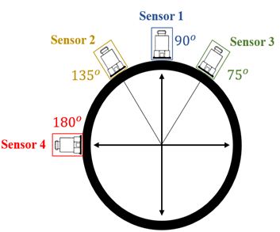

# Impact-force-identification-using-DL-and-ABC-SS
This repository contains datasets for identifying impact forces in steel pipeline segments impacted by materials such as aluminum, plastic, and rubber. The data is used in combination with machine learning techniques and approximate Bayesian computation by subset simulation.

The dataset includes information from four different segments of a steel pipeline, with impact data recorded at 11 distinct angles along the cross-section of each segment. The angles are as follows:

0.0°, 20.5°, 41.0°, 61.5°, 82.0°, 98.5°, 115.0°, 135.5°, 156.0°, 176.5°, and 197.0°

  

At each angle, impacts occur at various locations along the pipeline's depth. The dataset is organized into three impacting material types (aluminum, plastic, and rubber), and each material dataset contains:

  
 
  

Time (s)
Impact Force (N)
Acceleration Sensor 1 Response (g)
Acceleration Sensor 2 Response (g)
Acceleration Sensor 3 Response (g)
Acceleration Sensor 4 Response (g)

  

# Data Organization and Depth Calculation
Each segment folder contains files representing impacts at different angles, with varying numbers of files for each angle. For example, in Segment 1 at 0.0 degrees, there are 130 files. This means that for this specific angle, there are 130 different impacts recorded at 13 impact locations along the depth of the first segment of the pipeline, with 10 impacts per location.

Calculating the Depth:
For Segment 1: To determine the true depth in meters for each file, divide the file name by 100. For example, a file named 50 would represent a depth of 50 / 100 = 0.5 meters.

For Subsequent Segments (Segment 2 and beyond): To calculate the depth for files in Segment 2 or later, you must:

Add the final depth location of the previous segment to the file name value.
Account for an offset, as some areas between segments have no data collected.
For example, in Segment 2 at 0.0 degrees, with a file named 10:

The total depth calculation would be: 130 (final depth from Segment 1) + 10 (file name) + 20 (offset) = 160.
Then, divide by 100 to convert to meters: 160 / 100 = 1.6 meters.

  

These datasets can be used to study the effects of impacts by different materials at various angles on a steel pipeline. While this repository does not include analysis code, the data is formatted for easy use in machine learning models, impact identification algorithms, and structural health monitoring studies. For more information please refer to the research paper titled Impact-force Identification using Deep Learning and Bayesian Inference with Application on Pipeline Structures by Mu’men Hamadneh, Samir Mustapha, Mohammad Ali Fakih.
